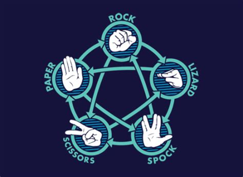

#  Rock Paper Scissor Lizard Spock


## About This Game


First started to settle dispute between Raj and Sheldon regarding TV.

The game was originally created by Sam Kass with Karen Bryla. According to an interview with Kass, the series producers did not originally ask for permission to use the game, but Kass was officially referenced by Sheldon as the creator of the game during the "The Rothman Disintegration", after which he states, "Hail Sam Kass!" to which Leonard, Howard, Raj, and Sheldon all then chant "Hail!" while raising their hands.

## Rules



## How to Play

### Single Player Mode

Allows single player to play agains computer generated move.


### Two Player Mode

Got Company! No problem choose two player mode and Spock! Spock! Spock!


## How to Launch

```python
python3 rockpaper.py
```

## Developer

### - *Prakhar Kaushik*


